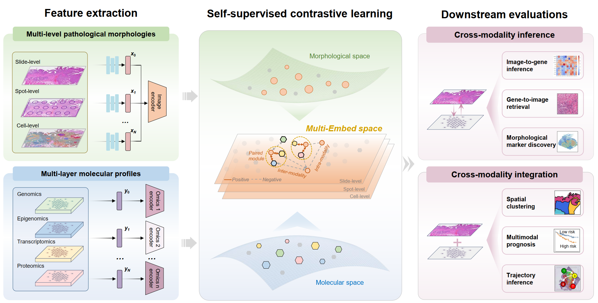
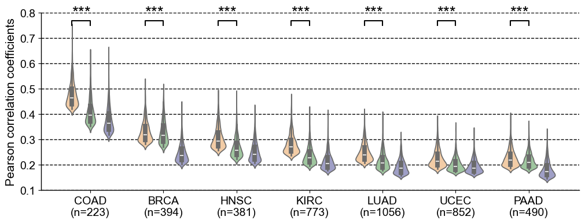
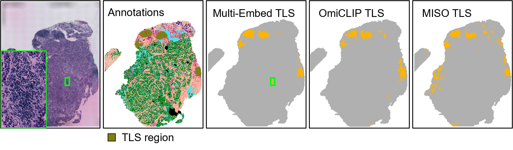
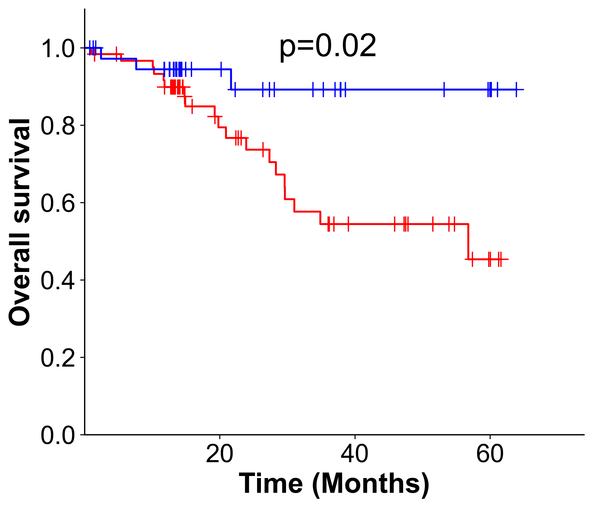
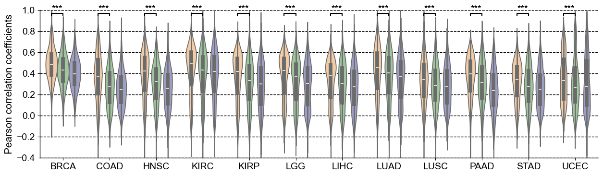
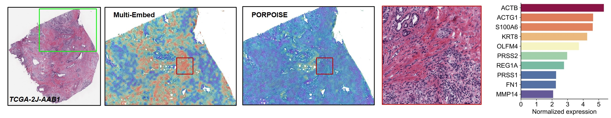
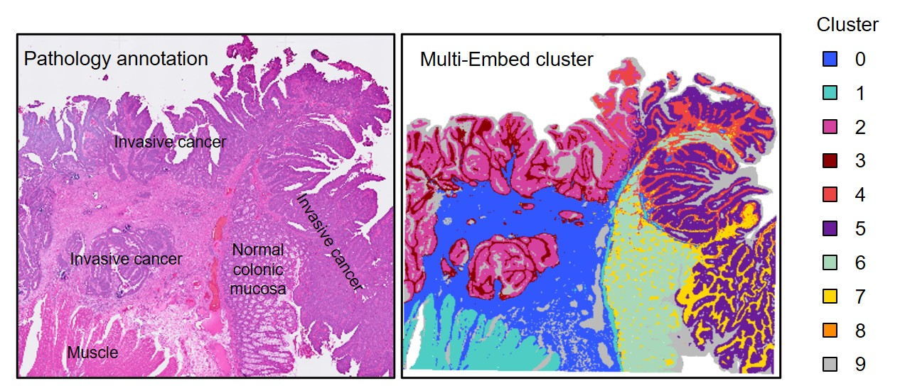

# Systematically decoding pathological morphologies and molecular profiles with unified multimodal embedding
This repository illustrates the implementations of our new multimodal learning method, **Multi-Embed**. **Multi-Embed** is a **unified**, **self-supervised** multimodal learning framework developed for cross-modality inference and integration of pathological morphologies and multiple types of molecular profiles, which is applicable to both large-scale cohorts and various spatial data. 
## Model architeture


## Environments
```sh
pip install -r requirements.txt
```

## Quick start
### Demo for gene expression prediction:
The gene expression prediction performance of Multi-Embed could be found in gene_expression.ipynb.
Here, we demonstrate the demo performance of Multi-Embed in morphology-related gene expression profiles prediction by training Multi-Embed and downstream prediction model on TCGA-COAD dataset, while evaluating its performance on CPTAC-COAD dataset.
For a quick demo, the pre-trained models could be accessed at [Google drive](d), including *epoch_247_TCGA_COAD.ckpt* and *gene_pred.ckpt*. The processed evaluation data could be assessed at [Tsinghua cloud](https://cloud.tsinghua.edu.cn/library/c23ff6a5-2627-4bae-9630-8d1f8ca90b20/Multi-Embed/COAD). 
```sh
# Step 1. Get Multi-Embed embeddings
python eval_slide_image.py \
--image_dir DIR_TO_DOWNLOADED_DATA \  # Download from Tsinghua cloud
--save_dir ./save/TCGA-COAD \
--omics_dim 1542 \
--data_type bulk \
--model_pth ./save/TCGA-COAD/epoch_247_TCGA_COAD.ckpt \
--image_dim 1024 \
--gpu 0 \
--img_type h5 \
--save_name CPTAC

# Step 2. Gene expression prediction
cd downstream
python rna_pred_external.py \
--val_image_dir ../save/TCGA-COAD/CPTAC.pkl \
--val_omics_dir DIR_TO_DOWNLOADED_DATA \  # Download from Tsinghua cloud
--save_dir ../save/TCGA-COAD/res.pkl \
--checkpoint ../save/TCGA-COAD/gene_pred.ckpt \
--omics_dim 16501 \
--image_dim 512 \
--hidden_dim 512 \
--gpu 0 \
--save_models \
--save_model_dir ../save/TCGA-COAD
```
Demo results are demonstrated below.


### Demo for tissue structure identification:
The TLS identification results can be found in TNBC_breast.ipynb. \
For a quick demo, the required input data can be downloaded from [Google drive](https://drive.google.com/drive/folders/1lrdq5JkDSBqzAvwWNV159-lWxPDaMywt?usp=sharing). Please place the *tnbc_sr.pkl* file under the directory ./demo/TNBC. \
Alternatively, you can reproduce the results by running the code below.
The corresponding image features and processed spatial gene expression data can also be downloaded from the same [Googld drive link](https://drive.google.com/drive/folders/1lrdq5JkDSBqzAvwWNV159-lWxPDaMywt?usp=sharing). After downloading, unzip *cnts.zip* and *features.zip*, and place the extracted files in ./demo/TNBC.
```sh
python train_st.py \
--image_dir ./demo/TNBC \
--omics_dir ./demo/TNBC \
--save_dir ./save/st \
--model_desc CN15_D2 \
--image_dim 1024 \
--omics_dim 4096 \
--shared_dim 512 \
--gpu 0 \
--data_type ST \
--batch 32 \
--prefix CN15_D2 \
--epoch 500 \
--index_type xy
```
```sh
python eval_slide_image.py \
--image_dir ./demo/TNBC \
--save_dir ./save/st/CN15_D2 \
--omics_dim 4096 \
--data_type ST \
--model_pth CKPT_PTH \  # e.g. ./save/st/CN15_D2/last.ckpt
--image_dim 1024 \
--gpu 0 \
--save_name CN15_D2_sr \
--prefix CN15_D2_sr_112
```
After running the above code, the pkl file in ./save/st/CN15_D2 should be the same with the one we provide. Demo results are demonstrated below.


### Demo for multimodal prognosis prediction:
Here, we demonstrate the demo performance of Multi-Embed in multimodal prognosis prediction by training Multi-Embed and downstream prediction model on TCGA dataset, while evaluating its performance on the independent datasets.
The prognosis prediction results can be found in tutorials/prognosis.ipynb. For a glance at the final results, the required input data can be downloaded from [Google drive](https://drive.google.com/file/d/14S4NXv_rF17h47lW1gaEDSefdWLVS2Aa/view?usp=sharing). Please put the prog_lung.pkl file under the directory ./demo/TCGA-LUAD.
For a quick demo, the pre-trained models could be accessed at [Google drive](https://drive.google.com/drive/folders/1laiuyXj5eMyp4sF_wWtn0SlkBYrc8FSJ?usp=sharing), including *epoch_248_TCGA_LUAD.ckpt* and *prognosis.ckpt*. The evaluation data could be assessed at [Tsinghua cloud](https://cloud.tsinghua.edu.cn/library/c23ff6a5-2627-4bae-9630-8d1f8ca90b20/Multi-Embed/LUAD).
```sh
# Step 1. Get Multi-Embed embeddings
python eval_slide_image.py \
--image_dir DIR_TO_DOWNLOADED_DATA \  # Download from Tsinghua cloud
--save_dir ./save/TCGA-LUAD \
--omics_dim 1549 \
--data_type bulk \
--model_pth ./save/TCGA-LUAD/epoch_248_TCGA_LUAD.ckpt \
--image_dim 1024 \
--gpu 0 \
--img_type h5 \
--save_name CPTAC

# Step 2. Multimodal prognosis prediction
cd downstream
python survival_external.py \
--feat_dir ../save/TCGA-LUAD/CPTAC.pkl \
--omics_dir ./ \
--survival_pth DIR_TO_DOWNLOADED_DATA \  # Download from Tsinghua cloud
--save_dir ../save/TCGA-LUAD \
--checkpoint ../save/TCGA-LUAD/prognosis.ckpt
```
Demo results are demonstrated below.
<div align = center>
  
</div>

## Data Format and Preprocessing

### Data availability
In this study, we trained and evaluated Multi-Embed across multiple types of data. All of these type of data could be used to develop your own Multi-Embed.
* For bulk data, we collected them from [TCGA](https://portal.gdc.cancer.gov/) and [CPTAC](https://portal.gdc.cancer.gov/projects/CPTAC-3) platform. We downloaded the tissue slide images and molecular profiles data, including gene expression (RNA-seq), methylation, protein abundance and genomic mutations data from TCGA dataset for model development and cross-validations, while downloaded the slide images and gene expression data from CPTAC dataset for external validations. Due to the large data volume, we provide [pre-trained models](https://drive.google.com) for each cancer type to facilitate quick reproduction of our method.
* For Visium data, we collected them from Zenodo and GEO platform. The HER2ST and 	TNBC ST data of human breast cancer used in this study are available at Zenodo under the accession code 3957257 and 14204217, respectively. The 10x Visium ST dataset of human stomach cancer used in this study was available at GEO platform under the accession code GSE287979.
* For Xenium and Visium HD data, the 10x Xenium ST dataset of [human breast cancer](https://www.10xgenomics.com/products/xenium-in-situ/preview-dataset-human-breast),  [lung cancer 1](https://www.10xgenomics.com/datasets/xenium-human-lung-cancer-post-xenium-technote) and [lung cancer 2](https://www.10xgenomics.com/datasets/preview-data-ffpe-human-lung-cancer-with-xenium-multimodal-cell-segmentation-1-standard) samples  are available at the 10x Genomics platform, while the 10x Visium HD dataset of [human colorectal cancer](https://www.10xgenomics.com/datasets/visium-hd-cytassist-gene-expression-libraries-of-human-crc) and [lung cancer](https://www.10xgenomics.com/datasets/visium-hd-cytassist-gene-expression-human-lung-cancer-post-xenium-expt) are also available at the 10x Genomics platform.

### Data preprocessing
* For the molecular profiles data, we performed normalization and log1p transformation and selected the highly variable genes using scanpy.
* For the pathology images, we applied the toolbox from [CLAM](https://github.com/mahmoodlab/CLAM) for image segmentation, stitching and patching. As for TCGA diagnostic images, patch of 256x256 pixels is recommended. And we extract the features for each tile with [UNI](https://huggingface.co/MahmoodLab/UNI). For feature extraction, please run the code below:
```sh
python extract_features.py
```

## Benchmark analysis
* Cross-validations:
Taking the gene expression prediction based on TCGA data as an example. Cross validation protocols for spatial gene expression prediction, multi-layer molecular profiles prediction and multimodal prognosis are the same.
1. Step 1: data split
``` sh
python data_split.py
```
The npy files for training and validation prefix are structured as below:
```
Prefix folder
├── folder_1.npy
│ ├── train_prefix
│ │ ├── 'TCGA-FB-A4P5-01A-01-TSA.AB111002-8155-440F-80B1-1F071714C322'
│ │ ├── 'TCGA-3A-A9IL-01A-01-TS1.F811C83B-1C85-4F69-9E14-E5104E385D84'
│ │ └── ...
│ ├── val_prefix
│ │ ├── 'TCGA-HZ-8002-01A-01-TS1.f4ffd4c9-ce00-43c5-a152-48151ba27a63'
│ │ ├── 'TCGA-HZ-8002-01A-01-BS1.00c0266c-8d6b-4f1b-9632-05f4e7bd9095'
│ │ └── ...
├── folder_2.npy
│ ├── train_prefix
│ │ └── ...
│ ├── val_prefix
│ │ └── ...
├── folder_3.npy
│ └── ...
├── ...
└── ...
```

> ⚠️ **NOTE:** To prevent information leakage, the training and validation data are kept consistent across the following two steps, through taking the same prefix file as input. (Parameters: --prefix)

2. Step 2: Train Multi-Embed
Run the code below for to train Multi-Embed on one fold.
```sh
python train.py \
--image_dir PATH_TO_IMAGE_FEATURES  \
--omics_dir PATH_TO_GENE_EXPRESSION_PROFILES \
--save_dir ./save/tcga_cv \
--model_desc MODEL_NAME \
--omics_dim GENE_EXPRESSION_FEATURE_DIMENSION \
--image_dim IMAGE_FEATURE_DIMENSION \
--data_type TCGA \
--shared_dim EMBEDDING_DIMENSION \
--gpu GPU_ID \
--prefix PATH_TO_npy_PREFIX_FILE
```
3. Train and evaluate the downstream prediction model with the same training and validation data:
* Gene expression prediction
```sh
cd downstream
python rna_mlp.py \
--image_dir FEATURES_FROM_Multi-Embed \
--omics_dir PATH_TO_GENE_EXPRESSION_PROFILES \
--save_dir SAVE_PATH \
--prefix PATH_TO_npy_PREFIX_FILE \
--omics_dim GENE_NUMBER \
--image_dim EMBEDDING_DIMENSION \
--hidden_dim HIDDEN_DIMENSION \
--gpu GPU_ID
```

We provide a cross-validation demo of TCGA-PAAD:
The image features should be extracted by UNI and stored in ./demo/TCGA-PAAD/h5_files as a pre-process step. Besides, the RNA-seq data as the supervision information could be downloaded from [Google drive](https://drive.google.com/file/d/12_OL1Gcnfmjg8u8BNxMK6Jpq7ryyH1aT/view?usp=sharing) and please put it at ./demo/TCGA-PAAD/cnts.tsv. As the big data volume, we provide the [pre-trained Multi-Embed](https://drive.google.com/file/d/1mOd0SXi8LK1WJuiWJwODY32-M3LkE9Vm/view?usp=sharing) for folder 1, where the training and validation samples could be found at ./demo/TCGA-PAAD/folder_1.npy. Download the 
```sh
# Step 1: folder split
python data_split.py
# Steps 2 and 3 should be repeated in each round of cross-validation. Here, only folder 1 is shown.
# Step 2: Multi-Embed development
python train.py \
--image_dir ./demo/TCGA-PAAD/h5_files  \  # The pathology image features extracted by UNI, see details in Data processing
--omics_dir ./demo/TCGA-PAAD/cnts.tsv \
--save_dir ./save/tcga_cv \
--model_desc PAAD_UNI_Exp_fold1 \
--omics_dim 1024 \
--image_dim 1024 \
--data_type TCGA \
--shared_dim 512 \
--gpu 0 \
--prefix ./demo/TCGA-PAAD/folder_1.npy
# Run inference for all data within TCGA-PAAD
python eval_slide_image.py \
--image_dir ./demo/TCGA-PAAD/h5_files \
--save_dir ./save/tcga_cv/PAAD_UNI_Exp_fold1 \
--omics_dim 1024 \
--data_type bulk \
--model_pth CKPT_PATH \  # Could be downloaded from Google drive for a quick start.
--image_dim 1024 \
--gpu 0 \
--img_type h5 \
--save_name tcga_paad
# Step 3: Downstream prediction
cd downstream
python rna_pred.py  \
--image_dir ../save/tcga_cv/PAAD_UNI_Exp_fold1/tcga-paad.pkl \
--omics_dir ../demo/TCGA-PAAD/cnts.tsv \
--save_dir ../save/tcga_cv/PAAD_UNI_Exp_fold1/gene_pred.pkl \
--prefix ../demo/TCGA-PAAD/splits/folder_1.npy \
--omics_dim 1024 \
--image_dim 512 \
--hidden_dim 512 \
--gpu 0
```
Cross validation protocols for multi-layer molecular profiles and spatial omics data are the same. Benchmark results on TCGA dataset are demonstrated below.


* External validations:

For external validation, we used datasets that are completely independent of the training data for model evaluation. \
e.g. Multi-Embed and gene expression prediction model were developed using TCGA data from each individual cancer type and were subsequently evaluated on the CPTAC dataset of the same cancer type. \
Here, the training command is the same with the cross-validations with setting prefix as *None*. The evaluation and downstream prediction command could be found in the part of *Quick start*.

## Train your own Multi-Embed
We also provide the code to develop Multi-Embed based on the given datasets.

### Model development
* Train Multi-Embed for TCGA data:
```sh
python train.py \
--image_dir PATH_TO_IMAGE_FEATURES  \
--omics_dir PATH_TO_GENE_EXPRESSION_PROFILES \
--save_dir ./save/tcga \
--model_desc MODEL_NAME \
--omics_dim GENE_EXPRESSION_FEATURE_DIMENSION \
--image_dim IMAGE_FEATURE_DIMENSION \
--data_type TCGA \
--shared_dim EMBEDDING_DIMENSION \
--gpu GPU_ID \
```
* Train Multi-Embed for ST data:
```sh
python train_st.py \
--image_dir PATH_TO_IMAGE_FEATURES \
--omics_dir PATH_TO_GENE_EXPRESSION_PROFILES \
--save_dir ./save/st \
--model_desc MODEL_NAME \
--image_dim IMAGE_FEATURE_DIMENSION \
--omics_dim GENE_EXPRESSION_FEATURE_DIMENSION \
--shared_dim EMBEDDING_DIMENSION \
--gpu GPU_ID \
--data_type ST_DATA_TYPE \  # Choices: ST, VisiumHD, Xenium
--batch BATCH_SIZE \
--prefix SAMPLE_PREFIXS \
--epoch TRAIN_EPOCH
```
* Inference:
```sh
python eval_slide.py \      
--image_dir PATH_TO_IMAGE_FEATURES \               
--omics_dir PATH_TO_GENE_EXPRESSION_PROFILES \
--save_dir ./save/st \
--image_dim IMAGE_FEATURE_DIMENSION \
--omics_dim GENE_EXPRESSION_FEATURE_DIMENSION \
--data_type DATA_TYPE \  # Choices: TCGA, ST, VisiumHD, Xenium 
--model_pth TRAINED_MODEL \
--prefix SAMPLE_PREFIXS \       
--save_name RESULT_FILE_NAME \                 
--gpu GPU_ID
```
More codes about model development will be released after publication of our paper.

## Other representative results

### Interpretable prognostic analysis (TCGA)


### Tissue architecture annotations (10x VisiumHD)
<div align = center>
  
</div>
