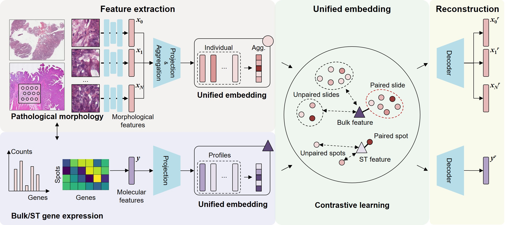
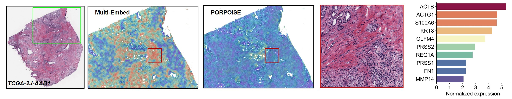
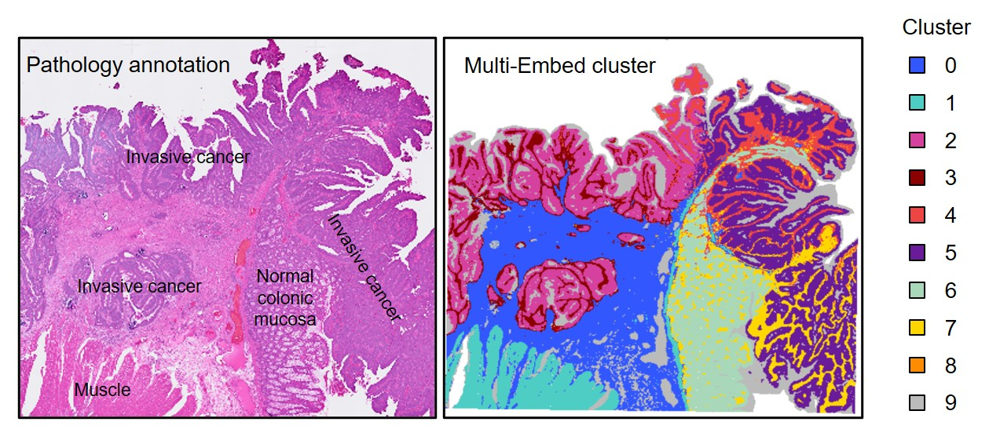
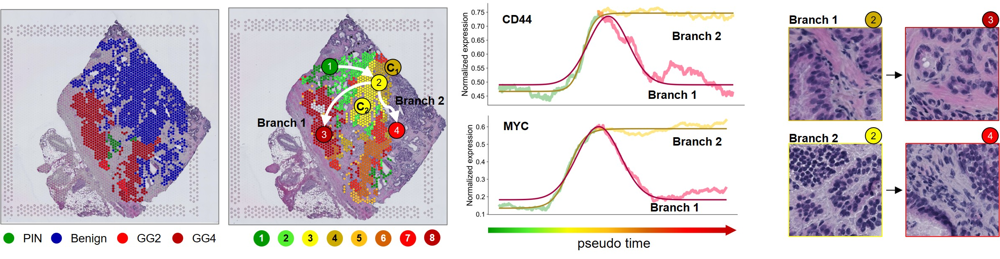

# Integration of pathological morphologies and molecular profiles with unified multimodal embedding
**Multi-Embed** is a **unified**, **self-supervised** multimodal learning framework to integrate pathological morphologies and gene expression profiles, which is applicable to both large-scale cohorts and various ST data. This repository illustrates the implementations of Multi-Embed in TCGA and various ST data.
## Model architeture


## Environments
```sh
pip install -r requirements.txt
```

## Data Format and Preprocessing

### Data availability
Multi-Embed could be applied to various data. Here, we use TCGA data and Visium data as an illustration.
* The TCGA data could be accessed at https://portal.gdc.cancer.gov/. We downloaded the both tissue slide images and RNA-seq data.
* The Visium ST data could be accessed at https://zenodo.org/records/14204217.

### Data preprocessing
* For the gene expression profiles, we performed normalization and log1p transformation and selected the highly variable genes using scanpy.
* For the pathology images, we applied the toolbox from [CLAM](https://github.com/mahmoodlab/CLAM) for image segmentation, stitching and patching. As for TCGA diagnostic images, patch of 256x256 pixels is recommended. And we extract the features for each tile with [UNI](https://huggingface.co/MahmoodLab/UNI). For feature extraction, you can run the code:
```sh
python extract_features.py
```

## Model development
* Train Multi-Embed for TCGA data:
```sh
python train_final.py \
--image_dir PATH_TO_IMAGE_FEATURES  \
--omics_dir PATH_TO_GENE_EXPRESSION_PROFILES \
--save_dir ./save/tcga \
--model_desc MODEL_NAME \
--omics_dim GENE_EXPRESSION_FEATURE_DIMENSION \
--image_dim IMAGE_FEATURE_DIMENSION \
--data_type TCGA \
--shared_dim EMBEDDING_DIMENSION \
--gpu GPU_ID \
```
* Train Multi-Embed for ST data:
```sh
python train_st.py \
--image_dir PATH_TO_IMAGE_FEATURES \
--omics_dir PATH_TO_GENE_EXPRESSION_PROFILES \
--save_dir ./save/st \
--model_desc MODEL_NAME \
--image_dim IMAGE_FEATURE_DIMENSION \
--omics_dim GENE_EXPRESSION_FEATURE_DIMENSION \
--shared_dim EMBEDDING_DIMENSION \
--gpu GPU_ID \
--data_type ST_DATA_TYPE \  # Choices: ST, VisiumHD, Xenium
--batch BATCH_SIZE \
--prefix SAMPLE_PREFIXS \
--epoch TRAIN_EPOCH
```
* Evaluation:
```sh
python eval_slide.py \      
--image_dir PATH_TO_IMAGE_FEATURES \               
--omics_dir PATH_TO_GENE_EXPRESSION_PROFILES \
--save_dir ./save/st \
--image_dim IMAGE_FEATURE_DIMENSION \
--omics_dim GENE_EXPRESSION_FEATURE_DIMENSION \
--data_type DATA_TYPE \  # Choices: TCGA, ST, VisiumHD, Xenium 
--model_pth TRAINED_MODEL \
--prefix SAMPLE_PREFIXS \       
--save_name RESULT_FILE_NAME \                 
--gpu GPU_ID
```
More codes about model applications including the prognostic prediction, super resolution tissue architeture annotations and spatiotemporal trajectory construction will be released after publication of our paper.

## Representative results

### Interpretable prognostic prediction (TCGA)


### Tissue architecture annotations (10x VisiumHD)
<div align = center>
  
</div>

### Malignant spatiotemporal trajectory construction (10x Visium)
