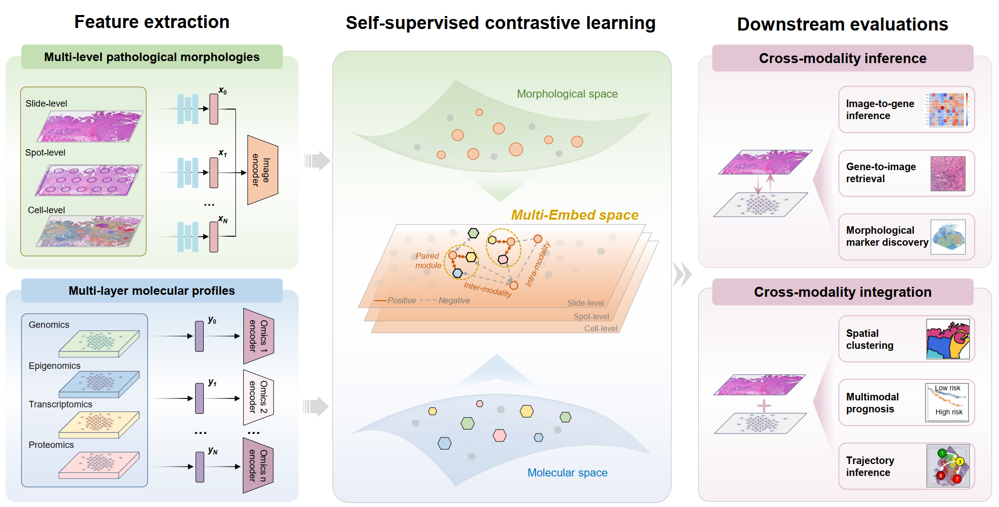
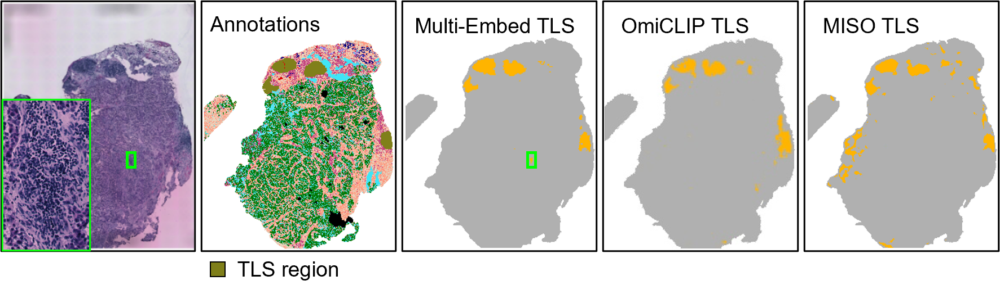
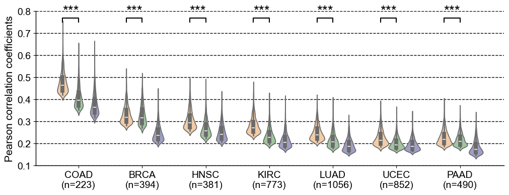
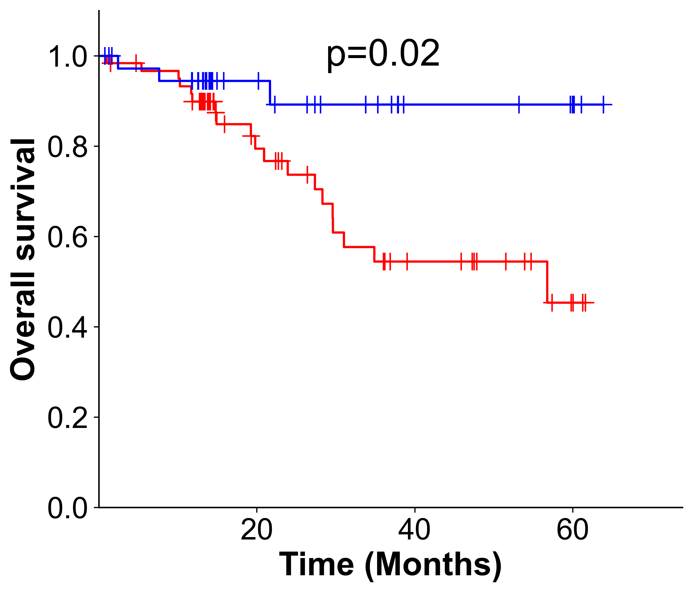
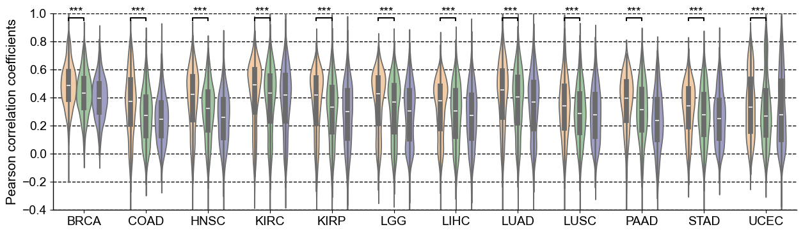

# Systematically Decoding Pathological Morphologies and Molecular Profiles with Unified Multimodal Embedding

This repository provides the official implementation of **Multi-Embed**, a unified self-supervised multimodal framework for integrating pathology image morphology and molecular profiles.

Multi-Embed supports:
- Slide-level multimodal embedding for bulk cohorts (e.g., TCGA/CPTAC)
- Spot-level embedding for spatial transcriptomics (ST) and multi-omics data
- Downstream tasks such as gene expression prediction and prognosis modeling

## Model Architecture



## Installation

```bash
pip install -r requirements.txt
```

## Repository Structure

```text
.
├── train.py                       # Train Multi-Embed on bulk data
├── eval_slide.py                  # Infer image+omics embeddings
├── eval_slide_image.py            # Infer image-only embeddings
├── data_split.py                  # Data splitting for cross validations
├── downstream/
│   ├── rna_pred.py                # CV gene expression prediction
│   ├── rna_pred_external.py       # External gene expression evaluation
│   ├── survival.py                # CV prognosis prediction
│   └── survival_external.py       # External prognosis evaluation
└── st_demo/
    └── st_pipeline.py             # ST demo pipeline
```

## Quick Start

### 1) Tissue structure identification (ST demo)

The simplified ST pipeline is in `st_demo/st_pipeline.py`.

1. Download demo files from [Google Drive](https://drive.google.com/drive/folders/1lrdq5JkDSBqzAvwWNV159-lWxPDaMywt?usp=sharing).
2. Put extracted ST demo files under `st_demo/TNBC/`.
3. Run:

```bash
cd st_demo
python st_pipeline.py
```

If you want clustering visualization, enable `--visualize` and provide `--mask-path`:

```bash
python st_pipeline.py \
  --visualize \
  --mask-path TNBC/mask.png \
  --save-dir ./results
```

Demo result:


### 2) External gene expression prediction (TCGA -> CPTAC demo)

This demo evaluates a pretrained downstream RNA model on an external cohort.

1. Download pretrained checkpoints from [Google Drive](https://drive.google.com/drive/folders/1gLF7GXVb8gT-IJZrifvWaU_tdUpUB7ql?usp=drive_link):
   - `epoch_247_TCGA_COAD.ckpt`
   - `gene_pred.ckpt`
2. Download processed external evaluation data from [Tsinghua Cloud](https://cloud.tsinghua.edu.cn/d/c1135a2e425b41548ce7/).

Step A: extract image embeddings with Multi-Embed

```bash
python eval_slide_image.py \
  --image_dir DIR_TO_DOWNLOADED_CPTAC_FEATURES \
  --save_dir ./save/TCGA-COAD \
  --save_name CPTAC \
  --data_type bulk \
  --img_type h5 \
  --model_pth ./save/TCGA-COAD/epoch_247_TCGA_COAD.ckpt \
  --omics_dim 1542 \
  --image_dim 1024 \
  --gpu 0
```

Step B: run external RNA prediction

```bash
cd downstream
python rna_pred_external.py \
  --val_image_dir ../save/TCGA-COAD/CPTAC.pkl \
  --val_omics_dir DIR_TO_DOWNLOADED_CPTAC_OMICS \
  --save_dir ../save/TCGA-COAD/res.pkl \
  --checkpoint ../save/TCGA-COAD/gene_pred.ckpt \
  --omics_dim 16501 \
  --image_dim 512 \
  --hidden_dim 512 \
  --gpu 0 \
  --hvg_path ../save/TCGA-COAD/hvgs.json
```

Demo result:


### 3) External prognosis prediction (TCGA -> independent cohort demo)

1. Download pretrained checkpoints from [Google Drive](https://drive.google.com/drive/folders/1laiuyXj5eMyp4sF_wWtn0SlkBYrc8FSJ?usp=sharing):
   - `epoch_248_TCGA_LUAD.ckpt`
   - `prognosis.ckpt`
2. Download evaluation data from [Tsinghua Cloud](https://cloud.tsinghua.edu.cn/d/7545bee1682a45e3bd59/).

Step A: extract image embeddings

```bash
python eval_slide_image.py \
  --image_dir DIR_TO_DOWNLOADED_EVAL_FEATURES \
  --save_dir ./save/TCGA-LUAD \
  --save_name CPTAC \
  --data_type bulk \
  --img_type h5 \
  --model_pth ./save/TCGA-LUAD/epoch_248_TCGA_LUAD.ckpt \
  --omics_dim 1549 \
  --image_dim 1024 \
  --gpu 0
```

Step B: run prognosis evaluation

```bash
cd downstream
python survival_external.py \
  --feat_dir ../save/TCGA-LUAD/CPTAC.pkl \
  --survival_pth DIR_TO_DOWNLOADED_SURVIVAL_CSV \
  --save_dir ../save/TCGA-LUAD \
  --checkpoint ../save/TCGA-LUAD/prognosis.ckpt
```

Demo result:
<div align="center">
  
</div>

## Benchmark Workflow (Cross-Validation)

### Step 1: Create grouped splits

Use grouped K-fold splitting:

```bash
python data_split.py \
  --data_dir PATH_TO_FEATURE_FILES \
  --save_dir PATH_TO_PREFIX_DIR \
  --pattern "*.h5" \
  --n_splits 5 \
  --seed 42 \
  --group_level patient \
  --prefix_format stem
```

Each fold file (e.g., `folder_1.npy`) stores:
- `train_prefix`
- `val_prefix`

Always reuse the **same prefix file** across Multi-Embed training and downstream training/evaluation for that fold.

### Step 2: Train Multi-Embed

```bash
python train.py \
  --image_dir PATH_TO_IMAGE_FEATURES \
  --omics_dir PATH_TO_OMICS_TABLE \
  --save_dir ./save/tcga_cv \
  --model_desc FOLD_1 \
  --omics_dim GENE_FEATURE_DIM \
  --image_dim IMAGE_FEATURE_DIM \
  --shared_dim 512 \
  --data_type TCGA \
  --gpu 0 \
  --prefix PATH_TO_PREFIX_DIR/folder_1.npy
```

### Step 3: Export image embeddings for downstream task

```bash
python eval_slide_image.py \
  --image_dir PATH_TO_IMAGE_FEATURES \
  --save_dir ./save/tcga_cv \
  --save_name fold_1_eval \
  --data_type bulk \
  --img_type h5 \
  --model_pth PATH_TO_MULTIEMBED_CKPT \
  --omics_dim GENE_FEATURE_DIM \
  --image_dim IMAGE_FEATURE_DIM \
  --gpu 0
```

### Step 4A: Train/evaluate downstream RNA model on the same fold

```bash
cd downstream
python rna_pred.py \
  --image_dir ../save/tcga_cv/fold_1_eval.pkl \
  --omics_dir PATH_TO_OMICS_TABLE \
  --save_dir ../save/tcga_cv/fold_1_rna.pkl \
  --prefix ../PATH_TO_PREFIX_DIR/folder_1.npy \
  --omics_dim GENE_NUMBER \
  --image_dim 512 \
  --hidden_dim 512 \
  --gpu 0
```

### Step 4B: Train/evaluate downstream prognosis model on the same fold

```bash
cd downstream
python survival.py \
  --feat_dir ../save/tcga_cv/fold_1_eval.pkl \
  --survival_pth PATH_TO_SURVIVAL_CSV \
  --save_dir ../save/tcga_cv/fold_1_survival \
  --prefix ../PATH_TO_PREFIX_DIR/folder_1.npy \
  --feat_dim 512 \
  --omics_dim 1024
```

Benchmark illustration:


## Train Your Own Multi-Embed

For bulk cohorts:

```bash
python train.py \
  --image_dir PATH_TO_IMAGE_FEATURES \
  --omics_dir PATH_TO_OMICS_TABLE \
  --save_dir ./save/your_project \
  --model_desc your_run \
  --omics_dim GENE_FEATURE_DIM \
  --image_dim IMAGE_FEATURE_DIM \
  --shared_dim 512 \
  --data_type TCGA \
  --gpu 0
```

For spatial data, start from `st_demo/st_pipeline.py` and replace input paths with your own files.

## Data Notes

- Molecular preprocessing typically includes normalization, log1p transform, and HVG selection.
- Pathology preprocessing can follow CLAM-style segmentation/patching pipelines.
- If needed, feature extraction is provided in `extract_features.py`.

## Additional Results

### Interpretable prognostic analysis (TCGA)


### Tissue architecture annotations (10x Visium HD)
<div align="center">
  
</div>
